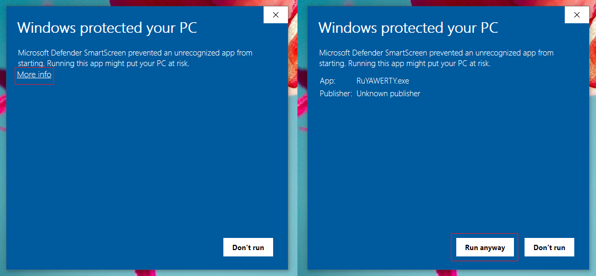
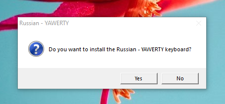
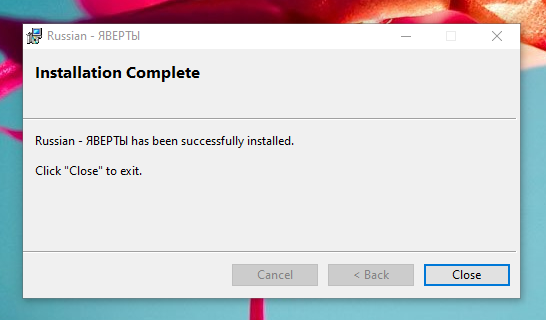
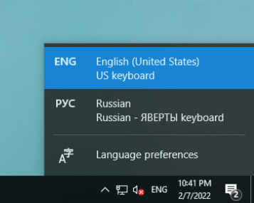
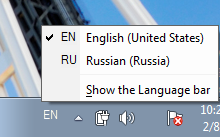

# yaWERTY
Russian ЯВЕРТЫ keyboard layout for Windows.
 
## Installation
Go to the [latest release](https://github.com/githubcatw/yaWERTY/releases/latest), download `RuYAWERTY.exe` and open it.

If you get a "Windows protected your PC" message, click "More info" and then "Run anyway". Russian ЯВЕРТЫ doesn't contain malware and only installs a keyboard layout.

You will be asked if you want to install the keyboard layout. Click Yes.

After some time you should get an "Installation Complete" message.

After installing you should have a Russian option in the Windows language bar:

| Windows 10  | Windows 7   |
| ----------- | ----------- |
|  |  |

To switch keyboard layouts press `⊞`+`Space` (Windows 8 or later) or `Alt`+`Shift`.

## Building the installer
First, set up the build environment (has to be performed once):
1. Download and extract the LZMA SDK from [here](https://www.7-zip.org/a/lzma1900.7z).
2. Copy `bin/7zSD.sfx` to this folder.

Then, build:
1. Build the layout in MS KLC.
2. Copy the resulting "ruyawert" folder here.
3. Compress **the contents** of the folder into a 7-Zip archive named `ruyawert.7z` and place it in the `ruyawert` folder. **If you compress the folder you will get a "File is corrupt" error when attempting to install the keyboard**
4. Run `build.bat`.
